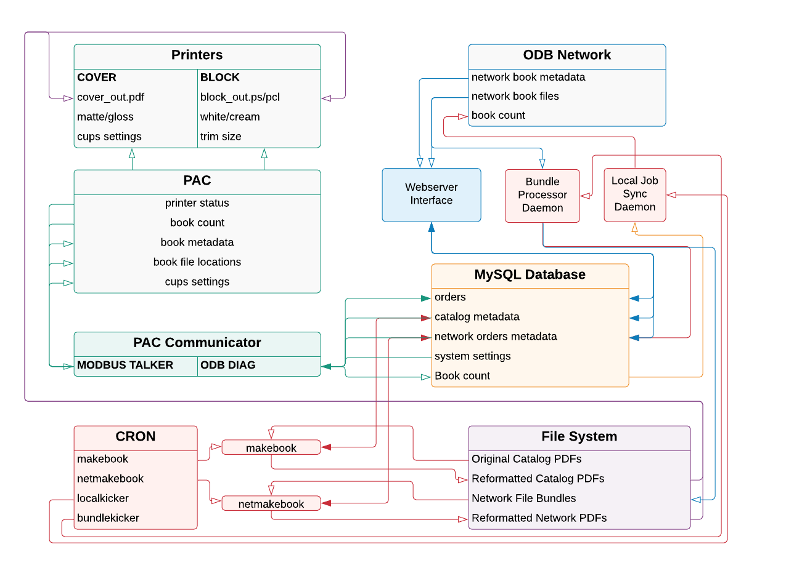

# EBM Printer Software
Version 2.0 (July 2019). written by Thor Sigvaldason, B Borges, and Emily McAllister

This repository contains the programs required to set up a new Espresso Book Machine (EBM) for printing books. It also contains the entire source code for the EBM. 

The EBM software can be broken up into two main pieces: the Webserver Interface and the PAC Communicator. The Webserver Interface provides the primary user interface for browsing the catalog, placing and editing orders, etc. It is run locally via an Apache server and accessed via the Chrome browser. The PAC Communicator is an I/O interface which communicates with the actual printer, sending and receiving data. It also provides a display for the next book in the queue and options to change the paper types. The PAC Communicator is run as its own executable file.

## System Structure
Each part of the system interacts with other parts, as outlined in the following diagram:

>(White arrows signify a one-way dataflow, where data is recieved but not modified at its source. Grey boxes indicate items which are external to this repository.)
The PAC Communicator, Webserver Interface, and background processing (cron and daemons) do not directly interact with one another; rather, metadata is stored within the MySQL database, and PDF files are saved to a shared location in the file system.  
The cron jobs run every two minutes in the background, processing PDF files into a printable format. 

## Languages
- The PAC Communicator is written using the Qt library for C++. It communicates to the PAC via Modbus. 
- The Webserver Interface is written in PHP.
- The various cron jobs run as shell scripts, but  makebook, netmakebook, and their respective dependencies are written in PHP.
- The daemons (job sync and bundle processor) are written in Python. 

## Operation

In order to operate the EBM, this repository must be downloaded onto a Mac Mini machine, then installed according to the [installation instructions](installation.md). Attach the Mac Mini to the printer hardware via USB cable. 

After the EBM software is installed and the machine connected, run the *PAC Communicator* application. Then, open Google Chrome and go to "http://localhost:8080" to bring up the web interface. 
